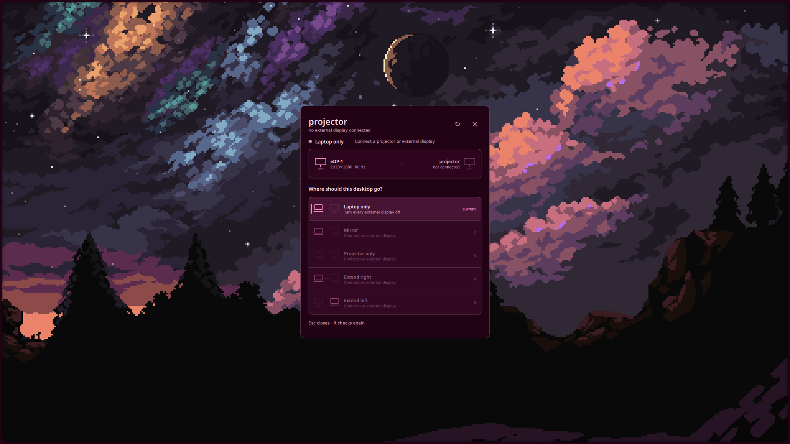

# projectorctl

A small display switcher for Hyprland laptops. It handles laptop-only, projector-only, mirror, and extended layouts without an `xrandr` script or a streamed virtual display.



The panel is just a chooser. The actual work is done by the CLI, so it is still usable from scripts and keybindings.

## Nix and Home Manager

Add the flake and import the module:

```nix
inputs.projectorctl.url = "github:nyxar77/projectorctl";

imports = [ inputs.projectorctl.homeManagerModules.default ];

programs.projectorctl.enable = true;
```

The module exposes three options:

```nix
programs.projectorctl.enable = true;
programs.projectorctl.enablePanel = true; # Quickshell chooser, on by default
programs.projectorctl.enableGuard = true; # unplug recovery, on by default
```

The flake also exposes packages directly:

```sh
nix profile install github:nyxar77/projectorctl
nix profile install github:nyxar77/projectorctl#panel
```

The first command installs `projectorctl`, the CLI and guard. The second installs the Quickshell panel. `homeManagerModules.default` is the Home Manager module, and `checks.controller` is the test check.

This project uses Hyprland's Lua configuration. Bind the panel wherever it makes sense in your config:

```lua
hl.bind("SUPER + P", hl.dsp.exec_cmd("projector-panel"))
```

The panel opens on every active screen and does not belong to a workspace. Run the same command again to close it.

## Without Nix

The CLI needs Bash, `jq`, `socat`, `timeout`, `flock`, and `udevadm`. Hyprland and a working `hyprctl` are assumed. `notify-send` and Caelestia are optional.

Install the two scripts somewhere on your `PATH`:

```sh
install -Dm755 src/projectorctl.sh ~/.local/bin/projectorctl
install -Dm755 src/projector-panel.sh ~/.local/bin/projector-panel
install -Dm644 ui/Projector.qml ~/.local/share/projectorctl/Projector.qml
```

The CLI works directly after that. To open the panel, point it at the QML file:

```sh
PROJECTORCTL_PANEL_QML=/path/to/projectorctl/ui/Projector.qml projector-panel
```

For a permanent panel keybinding, use the same command in your Hyprland Lua config:

```lua
hl.bind(
  "SUPER + P",
  hl.dsp.exec_cmd("env PROJECTORCTL_PANEL_QML=/path/to/projectorctl/ui/Projector.qml projector-panel")
)
```

To keep unplug recovery running, save this as `~/.config/systemd/user/projector-display-guard.service`:

```ini
[Unit]
Description=Projector display fail-safe
After=graphical-session.target
PartOf=graphical-session.target

[Service]
ExecStart=%h/.local/bin/projectorctl watch
ExecStopPost=-%h/.local/bin/projectorctl check
Restart=always
RestartSec=1

[Install]
WantedBy=graphical-session.target
```

Then enable it:

```sh
systemctl --user daemon-reload
systemctl --user enable --now projector-display-guard.service
```

## CLI

```sh
projectorctl status
projectorctl apply builtin
projectorctl apply external
projectorctl apply duplicate
projectorctl apply extend-left
projectorctl apply extend-right
projectorctl recover
```

`external` means projector only. `recover` brings the laptop panel back.

## If the screen stays black

Press `Ctrl+Alt+F12`. The Home Manager module installs this as a direct recovery binding, so it works without opening the panel.

The guard listens to Hyprland and kernel DRM hotplug events. There is also a slow 60-second check as a fallback, but it stays out of Hyprland when no guarded layout is active.

## Theme

The panel uses the current Caelestia scheme when one is available. Otherwise it uses its own small fallback palette.

## Check the repo

```sh
nix flake check
```

Without Nix, run the test scripts directly:

```sh
bash tests/controller.bash
bash tests/panel.bash
```
