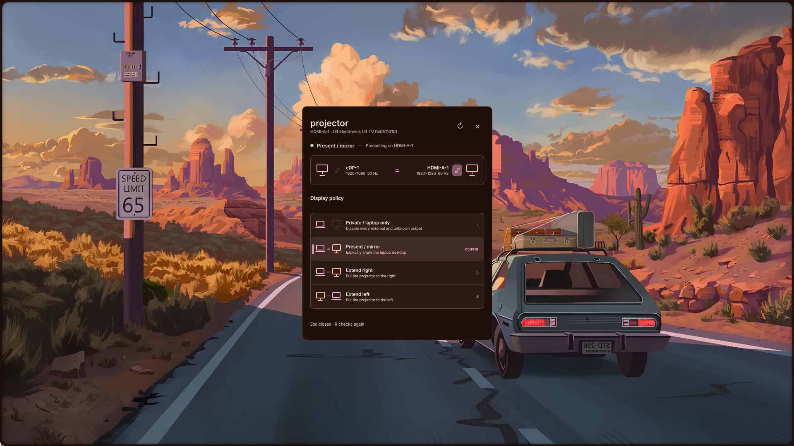

# projectorctl

`projectorctl` is a display switcher for Hyprland laptops. It provides safe,
explicit modes for keeping an external display private, mirroring a
presentation, or extending the desktop.



You can use it through the Quickshell panel, from the command line, or from a
Hyprland keybinding.

## Requirements

- Hyprland with Lua configuration support
- A laptop display reported as `eDP`, `LVDS`, or `DSI`
- An external display connected through HDMI, DisplayPort, or USB-C
- WirePlumber for automatic audio-output switching
- Quickshell if you want to use the panel

## Install with Home Manager

This is the recommended installation. Add the flake to your inputs:

```nix
inputs.projectorctl.url = "github:nyxar77/projectorctl";
```

Then import and enable it in your Home Manager configuration:

```nix
imports = [ inputs.projectorctl.homeManagerModules.default ];

programs.projectorctl.enable = true;
```

The module installs the CLI and panel, loads projectorctl's display rules into
Hyprland, adds the `Ctrl+Alt+F12` recovery keybinding, and starts the display
guard.

The panel and guard can be disabled independently:

```nix
programs.projectorctl = {
  enable = true;
  enablePanel = true; # Quickshell panel
  enableGuard = true; # Recover if the selected external display disappears
};
```

Apply your Home Manager configuration, then continue to [Usage](#usage).

## Install with Nix only

Install the CLI:

```sh
nix profile install github:nyxar77/projectorctl
```

To use the panel, install it as well:

```sh
nix profile install github:nyxar77/projectorctl#panel
```

Without the Home Manager module, you must also load the display rules in your
Hyprland Lua configuration:

```lua
dofile(os.getenv("HOME") .. "/.local/share/projectorctl/projector-layout.lua")
```

From a cloned checkout of this repository, copy the loader into that location
first:

```sh
install -Dm644 modules/projector-layout.lua ~/.local/share/projectorctl/projector-layout.lua
```

If you want automatic unplug recovery, follow the guard-service instructions
under [Manual installation](#manual-installation).

## Manual installation

The CLI requires Bash, `jq`, `socat`, `timeout`, `flock`, `udevadm`, and
`wpctl`. Hyprland and a working `hyprctl` are also required. The panel requires
Quickshell. `notify-send` and Caelestia are optional.

From a cloned copy of this repository, install the files under your home
directory:

```sh
install -Dm755 src/projectorctl.sh ~/.local/bin/projectorctl
install -d ~/.local/share/projectorctl/lib
install -Dm644 src/lib/*.sh ~/.local/share/projectorctl/lib/
install -Dm755 src/projector-panel.sh ~/.local/bin/projector-panel
install -Dm644 ui/Projector.qml ~/.local/share/projectorctl/Projector.qml
install -Dm644 modules/projector-layout.lua ~/.local/share/projectorctl/projector-layout.lua
```

Make sure `~/.local/bin` is on your `PATH`, then load the display rules from
your Hyprland Lua configuration:

```lua
dofile(os.getenv("HOME") .. "/.local/share/projectorctl/projector-layout.lua")
```

To run the panel, point it at the installed QML file:

```sh
PROJECTORCTL_PANEL_QML="$HOME/.local/share/projectorctl/Projector.qml" projector-panel
```

For automatic recovery when an external display is unplugged, create
`~/.config/systemd/user/projector-display-guard.service`:

```ini
[Unit]
Description=Projector display fail-safe
After=graphical-session.target
PartOf=graphical-session.target

[Service]
ExecStart=%h/.local/bin/projectorctl watch
Restart=on-failure
RestartSec=1
KillMode=control-group
TimeoutStopSec=10

[Install]
WantedBy=graphical-session.target
```

Enable the service:

```sh
systemctl --user daemon-reload
systemctl --user enable --now projector-display-guard.service
```

## Usage

### Panel

Run the following command to open the panel:

```sh
projector-panel
```

Run it again to close it. The panel opens on every active screen and offers
four display modes:

- **Private** keeps only the laptop display active.
- **Present** mirrors the laptop display to the external display.
- **Extend right** places the external display to the right.
- **Extend left** places the external display to the left.

With the Home Manager installation, you can bind the panel in your Hyprland
Lua configuration:

```lua
hl.bind("SUPER + P", hl.dsp.exec_cmd("projector-panel"))
```

For a manual installation, include the QML path in the binding:

```lua
local home = os.getenv("HOME")
hl.bind(
  "SUPER + P",
  hl.dsp.exec_cmd("env PROJECTORCTL_PANEL_QML=" .. home .. "/.local/share/projectorctl/Projector.qml projector-panel")
)
```

The panel also lets you choose an audio output associated with either display.

### Command line

Check the current display state:

```sh
projectorctl status
```

Change the display layout:

```sh
projectorctl apply builtin
projectorctl apply duplicate
projectorctl apply extend-right
projectorctl apply extend-left
```

Select an audio output directly:

```sh
projectorctl audio builtin
projectorctl audio external
```

Return to the safe laptop-only layout:

```sh
projectorctl recover
```

Layout changes automatically select the matching audio output when one is
available. Projector-only mode is intentionally unsupported because disabling
the laptop display makes Hyprland relocate workspaces.

## Recovery

If a display change leaves the screens black, press `Ctrl+Alt+F12`. The Home
Manager module and the manually installed layout loader both add this direct
recovery binding, so it works without opening the panel. You can also run:

```sh
projectorctl recover
```

The guard is active only while Present or Extend mode is selected. If the
external display disappears, it restores Private mode. Presentation layouts
are kept only for the current login session, so they do not silently return
after a reboot or new login.

If a switch to Present or Extend fails, inspect the last verification snapshot:

```sh
jq . "$XDG_RUNTIME_DIR/projector-control-$UID/last-verification.json"
```

## Appearance

The panel uses the current Caelestia color scheme when one is available and a
built-in fallback palette otherwise.
